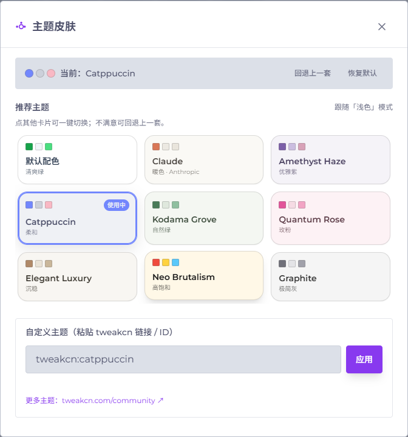
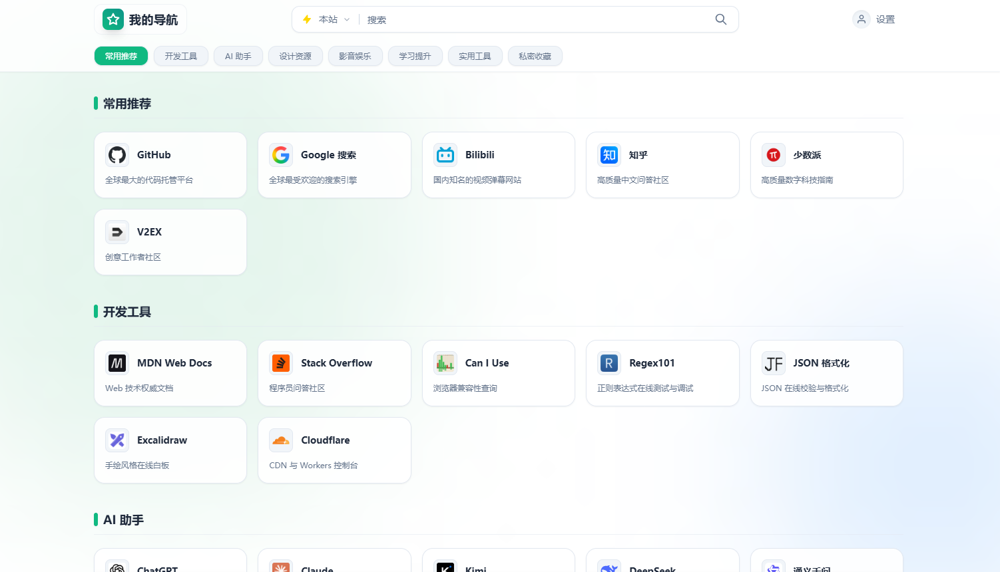
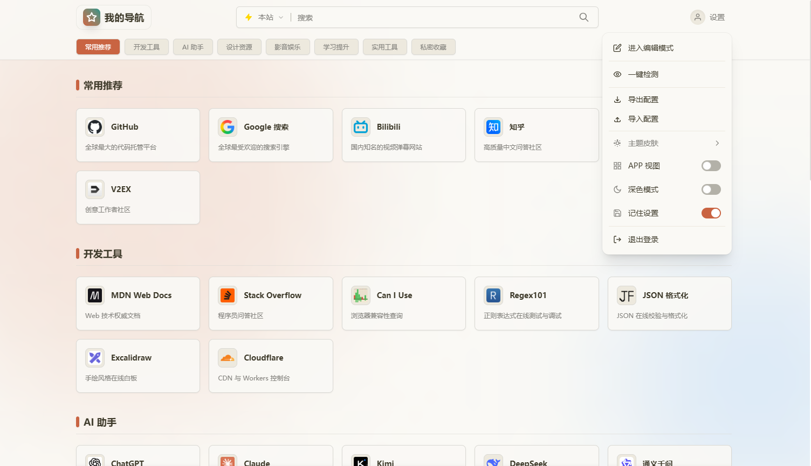
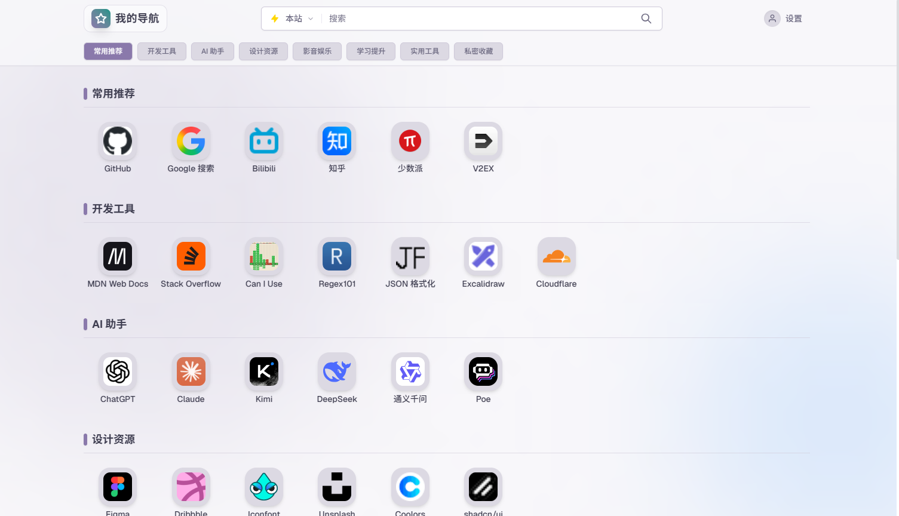
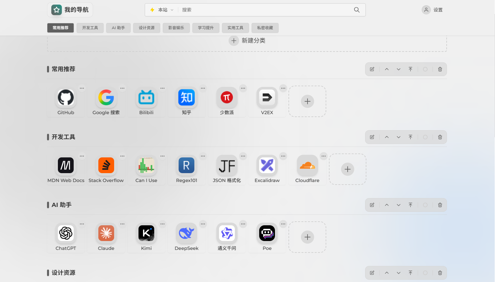

  <h1>cf-workers-nav  个人导航页</h1>
  

    一个部署在CF上的轻量化导航页
     
    <i>⚡ 轻松创建属于自己的导航主页</i>
  

📋 轻松部署的个人导航页 

> 一个部署在 Cloudflare Workers 上的轻量化导航页面。
> 集成书签管理、图标自动获取、拖拽排序、私密链接保护、**主题换肤**等功能。

## ✨ 主要特性

*   **⚡️ Serverless 架构**：完全运行在 Cloudflare Workers 上。
*   **💾 KV 存储**：数据存储在 Cloudflare KV 中。
*   **🎨 主题换肤**：内置 9 款主题 + 无限扩展的 tweakcn 社区主题，支持管理员一键发布全局主题。
*   **🌗 深色模式**：手动开关 + 跟随设备系统设置，每个访客的偏好独立保存在本地。
*   **🖱️ 拖拽排序**：支持 PC 端鼠标拖拽和移动端长按拖拽来整理分类与卡片顺序。
*   **🔒 私密保护**：支持设置“私密链接”，仅在管理员登录后可见。
*   **📂 数据管理**：支持在线添加/编辑/删除链接，支持导入 Chrome / Edge 的 HTML 书签，支持 JSON 格式的数据导入/导出及自动备份。
*   **🔍 聚合搜索**：内置多款搜索引擎（Google, Bing, Baidu）及站内快捷搜索。
*   **📱 响应式设计**：卡片视图 / APP 视图两种布局自由切换，适配 PC 与移动端。

## 🎨 主题换肤

入口：右上角「设置 → 主题皮肤」。**访客也能换肤**（仅对自己生效，保存在浏览器本地），**管理员**登录后切换主题会发布为**全局主题**，所有访客打开页面即是这套配色。

### 自定义主题（tweakcn 社区）

内置库看腻了？在弹窗底部的输入框粘贴 [tweakcn](https://tweakcn.com) 社区主题的 **ID 或完整链接**（`themes/xxx`），点击「应用」即可换肤。[更多主题 ↗](https://tweakcn.com/community)

## 界面预览

### 卡片视图
| default | claude |
|---|---|
|  |  |

### APP视图
| amethyst-haze | graphite |
|---|---|
|  |  |

## 部署方式

### 部署到Cloudflare

点击展开

#### 部署步骤

1. **登录 [Cloudflare](https://www.cloudflare.com)** 创建 Worker：
   - 复制仓库里 `workers.js` 的代码，粘贴进 Worker 编辑器，点击部署。

2. **创建 KV 存储**：
   - 新建一个名为 `CARD_ORDER` 的 KV 命名空间，用于存储数据。

3. **绑定 KV 命名空间**：
   - 在 Worker 的「设置 → 变量」中添加绑定，变量名称填 `CARD_ORDER`，绑定到上一步创建的 `CARD_ORDER` 命名空间。

4. **配置环境变量 / 设置**：
   - 必填与选填的各项配置见下方表格。

5. **添加域名**：
   - 若需自定义域名，在 Worker 的「设置 → 域和路由」中添加自定义域或用 `*.workers.dev` 子域。

 

#### 环境变量说明

> 表中标记了「必填」与「可选」；未配置选填项时将使用默认值。

| 变量名 | 必填 | 说明 | 默认值 |
|---|---|---|---|
| `ADMIN_PASSWORD` | ✅ 必填 | 管理员登录密码，至少 **8 个字符** | 无 |
| `JWT_SECRET` | ✅ 必填 | 用于加密 Token 的密钥，建议为 **≥32 字符** 的随机字符串 | 无 |
| `DEFAULT_USER` | ⬜ 可选 | 默认用户标识| `testUser` |
| `ALLOWED_ORIGINS` | ⬜ 可选 | 允许跨域访问的来源，多个用英文逗号分隔 | 空（不限制） |
| `ICON_API` | ⬜ 可选 | 图标API地址 |已内置xinac|
| `PREFER_ICON_API` | ⬜ 可选 | 是否优先使用图标API | `true` |

> **注意（老版本升级提醒）：**
> - 旧版本如果**未配置 `JWT_SECRET`**，或配置的 `JWT_SECRET` **小于 32 个字符**，必须重新配置一个 **≥32 字符** 的随机字符串，否则 Worker 会因配置校验失败（`JWT_SECRET 未配置或强度不足`）而无法正常工作。
> - 旧版本如果 **`ADMIN_PASSWORD` 小于 8 个字符**，请一并更新为**至少 8 个字符**的新密码，否则同样会触发配置校验失败。
> - 修改后需重新部署（或点击「保存并部署」）使配置生效。

## 🙏 致谢

特别感谢 **[Cloudflare](https://www.cloudflare.com/)** 、 **[Tailwind CSS](https://tailwindcss.com/)** 、 **[tweakcn](https://tweakcn.com/)**（主题库与社区主题）、 **[hmhm2022](https://github.com/hmhm2022)**、 **[xinac](https://api.xinac.net/)**。
